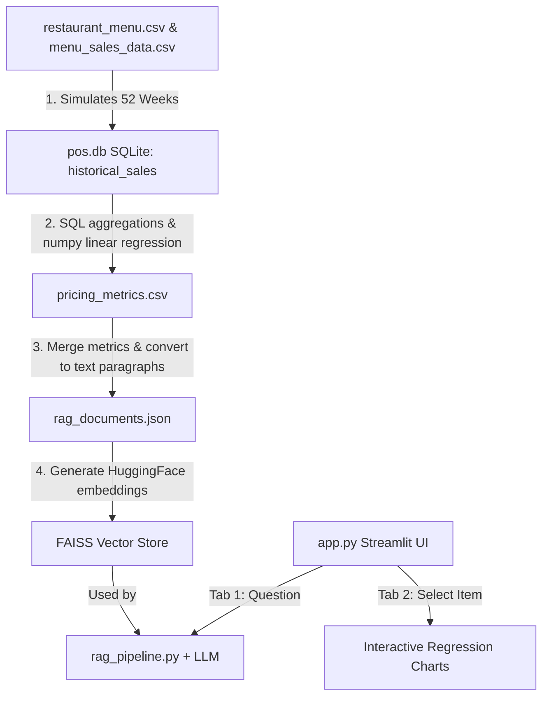

Imagine you run a restaurant and want to know: **"How should I price my menu to make the most profit, and how are my items performing?"** 

This project is an **AI Menu Engineering & Pricing Intelligence System** built to answer that question. It combines database aggregation, statistical modeling (linear regression), and Retrieval-Augmented Generation (RAG) to provide a dashboard where users can view interactive charts or ask questions in plain English.

Here is how the project works from start to finish, broken down step-by-step.

---

### 🗺️ The Architecture & Data Flow

---

### 🛠️ Step-by-Step Module Breakdown

#### 1. Data Simulation (`pos.db` SQLite)
Since real restaurant pricing history is private, [ingestion/simulate_history.py](file:///Users/ananyakashyap/Desktop/ai-menu-analyst/ingestion/simulate_history.py) generates a simulated 52-week time-series dataset. 
* **Pricing Fluctuations**: It varies the price of all 53 menu items weekly (due to promotions, weekend specials, etc.).
* **Demand Simulation**: It calculates the sales volume (units sold) based on **price elasticity** (e.g. if you raise the price of a beverage, sales drop faster than if you raise the price of a steak) and **seasonal spikes** (beverages sell more in summer).
* **Database**: This history is loaded into a SQLite database ([pos.db](file:///Users/ananyakashyap/Desktop/ai-menu-analyst/pos.db)) inside the `historical_sales` table.

#### 2. Pricing Intelligence & Regression (`pricing_metrics.csv`)
In [ingestion/train_pricing_model.py](file:///Users/ananyakashyap/Desktop/ai-menu-analyst/ingestion/train_pricing_model.py), we write SQL queries to extract features from our database (like average price, price volatility, and 12-week trends) and train a **Linear Regression model** for each item:
$$\text{Units Sold} = \alpha + \beta \times \text{Price}$$
* **Price Elasticity ($E$)**: Tells us how sensitive consumers are to price changes.
* **Profit Maximization**: Using the estimated slope ($\beta$) and intercept ($\alpha$), we calculate the **optimal price** that mathematically maximizes profit:
  $$P_{\text{opt}} = \frac{\alpha - \beta \times \text{COGS}}{-2\beta}$$
* **Profit Lift**: Estimates how much extra money the restaurant will make if they switch to the recommended price. These results are saved to `pricing_metrics.csv`.

#### 3. Knowledge Base & Vector Indexing (`faiss_index`)
To let users chat with their data, we need a search engine:
* **Paragraph Creation**: [rag_documents.py](file:///Users/ananyakashyap/Desktop/ai-menu-analyst/rag_documents.py) merges the menu details and regression pricing metrics to write descriptive paragraphs for each item (e.g., *"Garlic knots has a price elasticity of -1.4. Optimal price is $8.45..."*).
* **Vector Store**: We convert these paragraphs into numerical vectors (using a HuggingFace model) and index them in a local **FAISS vector database** (`data/processed/faiss_index`).

#### 4. The RAG Pipeline (`rag_pipeline.py`)
When you ask a question in the chat (like *"Which items are most price sensitive?"*):
* **Custom Router**: [rag_pipeline.py](file:///Users/ananyakashyap/Desktop/ai-menu-analyst/rag_pipeline.py) intercepts the query. If it detects keywords like "elastic" or "optimal price", it applies deterministic code sorting rules to rank the menu items directly by their regression coefficients.
* **Semantic Retrieval**: Otherwise, it searches the FAISS index to find the 3 most relevant documents.
* **LLM Explanation**: It feeds those documents as context into a GPT-4o-mini LLM, instructing it to draft a concise, factual summary response.

#### 5. Streamlit Frontend Dashboard (`app.py`)
Finally, [app.py](file:///Users/ananyakashyap/Desktop/ai-menu-analyst/app.py) serves the dashboard:
* **💬 Tab 1: AI Analyst Chat**: A clean chat interface connecting to the RAG pipeline.
* **📈 Tab 2: Pricing Intelligence**: An interactive playground. You choose a menu item, and the app runs a SQL query on the fly to draw:
  1. A 52-week time-series plot showing weekly price vs. sales.
  2. A scatter plot overlayed with the **fitted regression line (demand curve)** showing the exact mathematical relationship between price and sales.
  3. Metric cards displaying the optimal recommended price, current price, and estimated profit lift.

Here is the Tech Stack used in this project, categorized by layer:

🗄️ Database & Data Processing
SQLite: Local relational SQL database (

pos.db
) storing POS menu assets and transactional records.
Pandas: Handles feature engineering, merges computed metrics, and reads SQL tables.
NumPy: Calculates the linear regression slopes/intercepts ($\beta$, $\alpha$) and generates normal distribution noise for the time-series simulator.
🧠 Machine Learning & RAG Engine
LangChain: Orchestrates the RAG flow (prompts, LLM invocation, and parsing).
HuggingFace Embeddings (sentence-transformers/all-MiniLM-L6-v2): Converts menu item textual descriptions into dense 384-dimensional vectors.
FAISS (Facebook AI Similarity Search): Local in-memory vector database that handles similarity searches for the chatbot.
OpenAI (GPT-4o-mini): Explainer model that synthesizes natural language answers from retrieved database facts.
💻 User Interface & Visualization
Streamlit: Light-weight, high-performance web dashboard framework used to serve the interface.
Altair: Built-in interactive plotting library used to construct the weekly line trends and scatter plots with fitted regression lines.
python-dotenv: Manages local variables (like the OPENAI_API_KEY) securely.

Q1: Can you walk me through the end-to-end architecture of this system?
Answer:

"Certainly. The system is built as a data-to-insight pipeline containing four main layers:

Data Staging & SQLite Layer: We take raw menu and POS sales inputs, run SQL joins inside a SQLite database (

pos.db
), and model a 52-week pricing/sales transaction history table historical_sales.
Modeling Layer (Regression): We run SQL queries to pull weekly sales and prices, fit a linear demand curve regression model ($Q = \alpha + \beta \times P$) using NumPy, and output price elasticities and profit-maximizing price recommendations.
Semantic Indexing (RAG): We merge the regression outputs with basic menu indicators, compile them into descriptive text blocks, generate embeddings using a HuggingFace transformer model, and index them in a local FAISS vector database.
Serving Layer: A Streamlit frontend exposes two components: (a) A RAG chatbot powered by a custom routing retriever and GPT-4o-mini, and (b) An interactive visual dashboard showing historical trends and demand curve regression lines."
Q2: How did you implement the pricing optimization algorithm? What is the underlying math?
Answer:

"We modeled consumer demand for each menu item as a linear demand curve: $$Q(P) = \alpha + \beta \times P$$ Where $Q$ is units sold, $P$ is price, $\beta$ is the price-demand slope ($\beta < 0$), and $\alpha$ is the base demand intercept.

We manually calculated the coefficients using Ordinary Least Squares (OLS) equations in NumPy: $$\beta = \frac{\text{Cov}(P, Q)}{\text{Var}(P)} \quad \text{and} \quad \alpha = \bar{Q} - \beta \bar{P}$$

To optimize profit, we write the profit function as: $$\text{Profit}(P) = (P - \text{COGS}) \times Q(P) = (P - \text{COGS}) \times (\alpha + \beta \times P)$$

Taking the derivative with respect to price and setting it to zero ($\frac{d\text{Profit}}{dP} = 0$), we solve for the profit-maximizing optimal price ($P_{\text{opt}}$): $$P_{\text{opt}} = \frac{\alpha - \beta \times \text{COGS}}{-2\beta}$$

Finally, we applied business logic constraints in python (capping prices between COGS + $0.50 and current price + 40%) to ensure all recommendations are actionable and realistic."

Q3: What SQL-derived behavioral features are used, and how do they help diagnostics?
Answer:

"Rather than using static monthly metrics, we used SQL windowing and aggregations over the 52-week transactional database to derive temporal behavioral indicators:

Price Volatility Index: Calculated as the standard deviation of weekly price changes relative to mean price. This shows how frequently the item's price fluctuated during promotions.
Sales Trend Momentum: We isolated the last 12 weeks of sales units for each item, ran a quick linear regression against time (week), and classified the trend slope as Increasing, Decreasing, or Stable.
These SQL-derived features provide context to help restaurant managers understand if demand is changing due to recent trend shifts or historical price sensitivity."

Q4: Why did you choose a hybrid query router for RAG instead of standard semantic vector search?
Answer:

"Standard semantic search is great at text matching but struggles with structured operations like sorting or filtering (e.g. asking "Which items have the highest profit lift?" or "Which items are most price sensitive?").

To solve this, I built a keyword-based query router in 

rag_pipeline.py
. When a user asks about price sensitivity or optimal prices, the system intercepts the query, uses metadata filters to rank and sort the records deterministically by our regression coefficients (like price_elasticity or monthly_profit_lift), and feeds only the top ranked records to the LLM. For general questions, it falls back to default semantic vector matching. This ensures 100% mathematical accuracy for structured questions."

Q5: Can you describe a technical challenge you encountered during development and how you solved it?
Answer:

"One challenge was environment variable caching in development. When updating the OpenAI API key in the .env file, the running Streamlit server process kept using the old, expired key.

I realized that python-dotenv's default load_dotenv() function does not overwrite environment variables if they are already present in the parent process environment. To fix this, I modified the initialization in 

app.py
 and 

rag_pipeline.py
 to pass override=True:

python
load_dotenv(override=True)
I then terminated and restarted the background Streamlit process to clean the cache. This forced Python to reload the new key from the .env file, resolving the authentication issue."